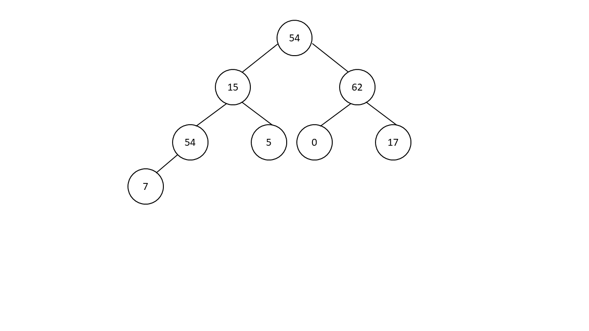

# 02/23 Worksheet: Binary Search Trees & AVL Trees
## Initial due date: *03/04 5pm*
### Accepted as on time until 03/06 11:59pm
Collaborators:

Answer the below questions, and make sure that you commit to your own branch.
When done, run your code through [the autograder](http://autograder.oxy.edu/) and make a pull request on github. Don't forget to tag @irabkina.
Respond to my comments by making new commits to the same branch.

**Be sure to complete the AVL Tree section of this worksheet *before* starting on P2.**

## Review

1. In your own words, what is a binary tree? What is a binary search tree? How do they differ?
2. Consider the following binary tree. What is the root node? What are the leaf nodes? What is the tree's height? 

3. In your own words, what is an AVL tree? How is it different from a binary search tree?

4.   
    a. In your own words, what is a rotation in an AVL tree?  
b. When do we perform rotations?  
c. What is the purpose of performing rotations? Be sure to explain the role of a node's balance factor in your answer.  
    d. Why is it important for an AVL tree to be balanced?

5. Perform a rotation at the root node of each of the following trees. Draw the result.    
a. 
     ```
          3
         / 
        2     
       /    
      1     
    
    ```  
   b. 
      ```
         1
          \
           2  
            \
             3

      ```


## Exploration
Next, we will write an IntBinarySearchTree class (writing a generic BST is possible, but more complicated). Starter code is available to you in IntBinarySearchTree.java. Please submit your code to the autograder and turn it in as part of your github submission.

1. The Node class for IntBinarySearchTree is given to you. What are its member variables? What does each represent?  
2. What member variables should IntBinarySearchTree have? Add those at the first FIXME.
3. Write the IntBinarySearch constructor. Note that it takes an integer `rootValue` as input.
4. Write the `add()` method for IntBinarySearchTree. Add takes a node, and places it in the proper location on a BinarySearchTree.
5. The textbook presented this recursive function (translated into Java) that searches through a binary search tree to find a node with a given value:

     ```java
     Node search(int key) {
         return search(this.root, key);
     }

     Node search(Node node, int key) {
         if (node != null) {
             if (key == node.key) {
                 return node;
             } else if (key < node.key) {
                 return search(node.left, key);
             } else {
                 return search(node.right, key);
             }
         }
         return null;
     }
     ```

     A version of this code can be found in `IntBinarySearchTree.java`.
    
     a. From this code, identify the wrapper function, the base cases, and the recursive cases.  
    
     b. What is the "smaller subproblem" in this recursive algorithm?  
    
     c. Notice that there are two recursive cases. Why do we need them both?  
    
     d. What is the relationship between the solution to the subproblem(s) and the solution to the original problem? That is, how is the solution to the subproblem(s) used to calculate the solution to the original problem?

6. For each of the following trees, give the balance factors of all nodes. If the tree is not balanced, state whether it is left heavy or right heavy, and at which node.    
a.
    ```
            4
          /   \
         2     5
        / \   / \
       1   3 4   6
    ```
    b. 
    ```
          7
         / \
        3   8
       / \   \
      1   5   9
           \ 
            6
    ``` 
    c.
    ```
            5
           / \
          3   6
         / \   \
        2   4   7
       /
      1
     /
    0
    ```
    d. 
    ```
            4
          /   \
         2     9
        / \     \
       1   3     12
      /           \
     0             13
    ```

## Challenge

1. Any function that visits every element of a data structure is called a *traversal*. For binary search trees, there are three different natural traversals: *in-order traversal* (where the smaller elements are printed before larger elements), *pre-order traversal* (where the parent is printed before the children), and *post-order traversal* (where the children are printed before the parent). In this question, we will walk through writing an in-order traversal function, `inOrderPrint()`. So, calling `inOrderPrint()` on the following tree:

    ```
          4
         / \
        2   5
       / \   \
      1   3   6
     /
   0
    ```

    will print:

    ```
    0
    1
    2
    3
    4
    5
    6
    ```

    We will start with the following template, where I've written the initial recursive call in the wrapper function:

    ```java
    public void inOrderPrint() {
        inOrderPrint(this.root);
    }

    private void inOrderPrint(Node node) {
        // FIXME
    }
    ```

    a. Using the initial recursive call (`inOrderPrint(this.root)`), explain the subproblem(s) of printing out a tree in order.

    b. What is the relationship between the subproblem(s) and the original problem?

    c. What is the base case? What is the smallest possible tree? What should happen in the base case?

    d. Write the recursive function, which should have 4 non-empty lines: the condition to check for the base/recursive case, the two recursive calls, and what to do with the current node. Keep in mind that we are writing an in-order traversal of a binary search tree, meaning that smaller numbers should be printed first.

    The solution to this question is near the bottom of `IntBinarySearchTree.java`, but I encourage you to complete the function without looking at it.

2. Using the process we went through above, write a recursive function, `int sum()`, that adds up the values in a binary tree and returns the total.

3. Now, we will write a recursive function, `boolean isBinarySearchTree()`, that returns `true` if and only if a binary tree is a binary search tree. You may assume that the binary tree will only contain non-negative numbers.    
a.   What is the smaller subproblem of identifying a binary search tree? 

   b. What relationship between parent and children must be true in a binary search tree? 
   
   c. If the above relationship doesn't hold for any node, you know that the tree as a whole is not a binary search tree. What base cases does that fact lead to? (*Hint*: there should be 4)  
   
   d. What is the fifth base case for `isBinarySearchTree()`?  
   
   e. Write the base cases in the `isBinarySearchTree()` method of `IntBinarySearchTree.java` 
   
   f. Given your answer to a, above, what is the recursive case? Write it in the `isBinarySearchTree()` method of `IntBinarySearchTree.java`. 

   Note: this is a challenging question, and it's doubly important that you understand what the subproblem(s) are and how it relates to the original problem. You should have a clear idea of what should happen *before* you start writing code.

For questions 4 and 5, consider the following tree:
```
        11
       /  \
      6    17
     / \    \
    4   10   26
   /
  2
```
4. We are now going to insert a node with the value 0 into the tree.    
a. Using the standard binary search tree add, where will the new node be placed in the tree? Draw out the tree with the new node.   
b. What is the balance factor of each node? Is the tree balanced?  
c. Is the tree left heavy or right heavy (i.e., what is causing it to be unbalanced)?   
d. At what node do we need to perform a rotation? Will it be a single rotation or a double rotation? Will it be a right rotation, a left rotation, or one of each?  
e. Draw the tree after performing the rotation.   
f. What is the balance factor of the tree now? Is it balanced?

5. We are now going to insert a node with the value 19 into the tree.    
a. Using the standard binary search tree add, where will the new node be placed in the tree? Draw out the tree with the new node.   
b. What is the balance factor of each node? Is the tree balanced?  
c. Is the tree left heavy or right heavy (i.e., what is causing it to be unbalanced)?   
d. At what node do we need to perform a rotation? Will it be a single rotation or a double rotation? Will it be a right rotation, a left rotation, or one of each?  
e. Draw the tree after performing the rotation.   
f. What is the balance factor of the tree now? Is it balanced?
